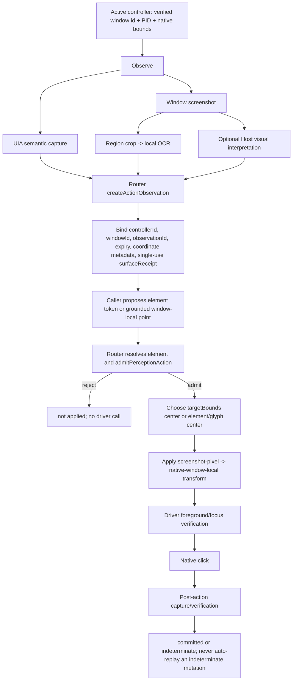

# Computer Use `.91` fact-flow and state-ownership audit

> Phase 3 resolution: the duplicate authorities identified below were removed
> by MCP schema `6.0`. See
> `computer-use-phase-3-interaction-contract.md` for the current Host Scene and
> three-state action contract. The tables below remain the frozen `.91`
> baseline audit rather than a description of the new implementation.

Date: 2026-08-01  
Baseline: `0.0.26-local.20260801.91`  
Policy: freeze this baseline; do not publish another candidate or run combination campaigns until the three atomic proof gates pass.

## 1. Provenance boundary

The `.05` manifest identifies `0.0.26-local.20260731.5` with source commit `5a5bb6e`. The `.91` manifest identifies `0.0.26-local.20260801.91` with source commit `e43eeec`. The local candidate manifests record a source commit but do not record a dirty-worktree digest. Therefore the exact byte-level source delta for every candidate number cannot be reconstructed from Git and the manifests alone.

The reconstructable sequence is:

| Candidate interval | Recorded source | Reconstructable change |
| --- | --- | --- |
| `.05–.48` | `5a5bb6e` | No committed source transition between these candidates; any candidate differences are outside the recorded provenance. |
| `.49` | `7590316` | Align interactive contracts. |
| `.50` | `43ec532` | Normalize duplicated Agent action envelopes. |
| `.51` | `6e32ec4` | Retry missing screenshot handoffs. |
| `.52` | `c19228e` | Derive matching action receipts. |
| `.53` | `86febb9` | Verify foreground before interactive actions. |
| `.54` | `3110556` | Preserve verified child focus. |
| `.55` | `a1e11ac` | Bypass IME composition for Unicode input. |
| `.56` | `d851546` | Bind native text entry to verified focus. |
| `.57` | `e28100f` | Consume fresh post-action evidence. |
| `.58` | `2772a1a` | Isolate IME during incremental Unicode input. |
| `.59` | `b441bb1` | Keep coordinate text on the native driver path. |
| `.60` | `56fb44d` | Collapse acquisition discovery rounds. |
| `.61–.91` | `e43eeec` | Verify window focus before typing; no later committed source transition is recorded by these candidates. |

This is an audit limitation, not evidence that `.05–.48` or `.61–.91` were byte-identical.

## 2. Current fact owners

| Fact | Producer | Current owner/arbitrator | Lifetime | Known overlap |
| --- | --- | --- | --- | --- |
| Native window identity, PID, native bounds, foreground identity | CUA driver plus Windows foreground/window probes | `CuaDriverMcpDriver` verifies and reconciles; Router binds it to the active controller | Lease/window change | Process discovery, tray restore, UIA capture, and screenshot capture can each report window identity. |
| Semantic role, value, state, actions, element token | CUA driver UIA tree | Router observation plus `admitPerceptionAction` | Observation/lease expiry | OCR also emits role `text`, actions, and geometry but cannot prove container ownership. |
| OCR text, glyph bounds, confidence, model identity | Local OCR sidecar | OCR normalization; Router later admits or rejects a proposed action | Screenshot/region/cache key | Primary and secondary OCR observations are flattened; their parent-region identity is not retained per element. |
| Screenshot bytes and pixel dimensions | CUA driver screenshot artifact | Driver verifies the requested window and Router creates an action observation | Observation/receipt expiry | Host vision may interpret the same pixels without becoming a structured scene owner. |
| Visual layout interpretation | Host image-understanding request | Model-facing projection only; Router admission still owns execution | Single visual question/observation | The present code has no unified evidence-conflict object shared with OCR/UIA. |
| Coordinate space and scale | Driver `coordinateScale`; OCR crop translation; Router action observation | Router `resolveDriverActionTarget` is the last transform before the driver | Observation/receipt expiry | Callers may supply points and target bounds; Router recenters some actions on `targetBounds`. |
| Action authority | Tool schema guidance, Router receipts, policy, `admitPerceptionAction` | Router is the final executable authority | One admitted operation | OCR projection says `observationOnly`, while exact high-confidence OCR text can still authorize a click. This is duplicate policy authority. |
| Surface freshness | Router `surfaceReceipt` | Router compares lease/window/observation and consumes the receipt | Single use | Receipt inference and focus continuation add separate exceptions. |
| Editable focus continuation | Driver focus verification, Router `focusReceipt`, `recentEditableTarget` | Router | Short receipt TTL | Transient keyboard selection fallback uses focus and mutation evidence as another local authority. |
| Cached perception | Region cache, last screenshot/capture, semantic alias maps | Router | Must end at release/revoke/expiry/restart | Before this repair, several caches survived release and could cross into a new lease. |
| Turn ownership | Runtime Host `_meta` resource record | Runtime Host finalizer calls `computer.release` on completed, cancelled, and error terminals | Turn | Connector-side cancel/revoke/close also clean resources; responsibilities are complementary but cleanup must be idempotent. |

## 3. Observation-to-click fact flow

The effective click arbitrator is the Router: it checks controller/window/observation freshness, receipt consumption, action policy, geometry safety, and `admitPerceptionAction`, then transforms and submits the target to the driver. The LLM proposes; it does not directly click.

## 4. Coordinate ledger

All executable coordinates end at native **window-local** units.

1. Screenshot capture reports PNG width/height and native window width/height.
2. The driver records `sourceSpace: screenshot-pixel`, `actionSpace: window-local`, and:

   `nativeX = screenshotX * (nativeWidth / screenshotWidth) + offsetX`

   `nativeY = screenshotY * (nativeHeight / screenshotHeight) + offsetY`

   Current offsets are zero because both spaces have the same window origin.
3. OCR may run on a crop that is internally enlarged. OCR result bounds are converted back with:

   `screenshotX = ocrX / ocrScaleX + cropOffsetX`

   `screenshotY = ocrY / ocrScaleY + cropOffsetY`

   Width and height are divided by the same OCR scale. The result is full-screenshot, window-local pixel geometry.
4. Screen-space points, where accepted at an adapter boundary, subtract the verified native window origin before becoming window-local.
5. For coordinate text focus and clicks carrying `targetBounds`, the Router discards an arbitrary supplied point and executes at the rectangle center after validating that rectangle against the same observation.
6. The Router applies the screenshot-to-native `actionTransform` once. The driver receives native window-local x/y plus the verified window identity.

A coordinate is not complete evidence unless it carries: screenshot/observation ID, window ID, coordinate space, crop offset, scale/transform, parent region, and expiry. The new independent scene model enforces these fields and rejects evidence outside its declared parent.

## 5. Active, compatibility, and fallback paths

### Active public path

- `computer.acquire`: resolves/restores one verified window and creates a lease.
- `computer.observe`: state, semantic, screenshot/OCR, or explicit visual escalation.
- `computer.act`: one receipt-bound action followed by verification where requested/required.
- `computer.release`: aborts and joins in-flight desktop mutations, clears lease-scoped evidence, and stops control visuals.

### Active internal fallbacks

- Semantic observation falls back to screenshot plus local OCR when UIA cannot resolve the next decision.
- Changed screenshots run bounded primary/secondary region OCR before Host vision.
- Unicode text uses a private PowerShell/native bridge after foreground and focus checks.
- Application restoration may use existing windows, owned modal windows, tray accessibility invocation, or launch.
- A verified editable focus may allow one receipt-bound targetless keyboard continuation.

### Compatibility surfaces

- `LEGACY_COMPUTER_USE_MCP_TOOLS` still defines `computer.approve`, `computer.revoke`, `computer.list_state`, `computer.capture_window`, `computer.ocr_region`, and `computer.observe_diff` for old phase/test surfaces; they are not the four-tool Agent contract.
- `titlePart` and duplicated action-envelope normalization remain compatibility input paths beside exact application/window identity and the canonical action envelope.
- Both `AGENT_COMPUTER_USE_*` and older `XIAOZHICLAW_*` environment aliases are accepted by driver/install resolution.

## 6. Duplicate authorities and defects found

1. **OCR action contradiction.** Model-facing text calls OCR elements observation-only, but admission still permits a high-confidence exact OCR text click. Until the unified Scene contract replaces this split policy, OCR text activation remains a narrowly scoped compatibility exception, not proof of a parent control.
2. **Region ownership loss.** `mergeLocalOcrObservations` concatenates primary and secondary elements/text without retaining each element's parent region. Search, dropdown, history, and chat text can consequently enter the same flat observation.
3. **No shared conflict object.** UIA, OCR, and Host vision do not publish claims into one conflict ledger. The independent `buildRegionOwnedScene` model now rejects parent violations and makes any conflicting claim non-actionable; it is intentionally not yet wired into the Agent path.
4. **Lease-scoped cache residue.** `lastCapture`, screenshot/visual caches, consumed receipt, focus state, recent editable geometry, and semantic aliases previously survived `computer.release` and could influence a later lease. They now clear through one state-reset owner on cancel, revoke, replacement, expiry, close, and new grant.
5. **Stop completion ambiguity.** Cancel aborted operations but did not explicitly join every admitted desktop mutation before returning. It now joins them before returning and before a new lease can be considered clean.
6. **Unicode error collapse.** Non-zero bridge exits and stdin failures collapsed into `unicode_input.bridge_failed`. Errors now identify preflight/validation/bridge-start/bridge-input/bridge-execution/bridge-response and report `not-applied` or `indeterminate` plus possible focus, selection, text, clipboard, and IME side effects.

## 7. Deletion candidates

Deletion is gated on consumer search and replacement proof; these are candidates, not an instruction to remove compatibility blindly.

| Candidate | Why it is redundant | Required proof before removal |
| --- | --- | --- |
| Legacy tool schemas and handlers for approve/revoke/list-state/capture-window/ocr-region/observe-diff | The Agent contract exposes acquire/observe/act/release. | Runtime, inspector, and external consumer search shows no calls; equivalent diagnostic coverage remains. |
| Duplicated cancel/revoke/expiry/close cache-reset blocks | Multiple lifecycle paths owned the same fields and drifted. | Completed in this repair by centralizing lease interaction state reset. |
| OCR `actions: ["click"]` plus exact-OCR admission exception | Conflicts with the declared observation-only authority and the future Scene evidence contract. | Scene integration supplies a structured, consistent parent and explicit action, and fixed screenshots prove no regression. |
| Flat primary/secondary OCR merge | It destroys region ownership. | Replace with region-owned claims; all observation projections and post-action verification consume them. |
| Transient list-item Enter compensation | It infers a list action from focus/mutation/region heuristics outside a unified Scene/state machine. | Deterministic state machine proves the same transition using explicit transient-surface ownership and postcondition. |
| Duplicated action envelope and `titlePart` compatibility normalization | Canonical action and exact window/application identity already exist. | Host and supported clients emit only canonical contracts for a deprecation window. |

## 8. Atomic proof gates

The Agent/full WeChat flow stays disabled for qualification until all three are independently proven:

1. **Chinese input:** real WeChat search and message editors, each with focus, replace-all, exact Chinese entry, read-back, partial-failure receipt, and cancel; 20 consecutive successes.
2. **Region ownership:** fixed real screenshots prove search/dropdown/history/chat isolation, complete coordinate provenance, and no actions on OCR/structure/visual conflict.
3. **Lifecycle/cancel:** normal release, terminal auto-release, Stop cancellation/join, no post-Stop mutation, immediate reacquire, and restart without control residue.

Unit and fixture tests establish contract behavior but do not satisfy a real-WeChat proof gate. No candidate artifact may be generated from this audit alone.

## 9. Atomic proof result on the frozen baseline

Executed on 2026-08-01 from `main`, without an Agent or LLM in the action loop and without clicking a candidate or sending a message:

| Gate | Result | Evidence boundary |
| --- | --- | --- |
| Real search editor Unicode primitive | **Passed 20/20 consecutive** | Every attempt used a new screenshot digest, exact window ID, screenshot-pixel space, crop offset, and scale-to-native transform. Replace-all Chinese input was followed by two agreeing region-local OCR observations. |
| Real message editor Unicode primitive | **Passed 20/20 consecutive** | The full editor rectangle selected the safe center; an editor-contained text band performed read-back. The verifier accepts only exact value or exact value plus one OCR caret code point. No send action was available to the script. |
| Real in-flight cancellation | **Passed for both editors** | Each editor first ran one bounded cancellation. The operation returned `operation.cancelled`; before/after region-value hashes agreed in the passing runs. |
| Real fixed screenshot region ownership | **Passed** | Screenshot `a145537d593bdb71c349aff0284c8372f1236fbff46d47fe529414a40d15562e`; six independent crops produced search 2, dropdown 29, history 21, chat 17, message 5, toolbar 3 OCR claims; parent violations were zero. A cross-parent structure/visual conflict remained non-actionable with conflicts `parent`, `role`, and `bounds`. The temporary screenshot and raw text were deleted. |
| Router lifecycle/cancel/disconnect | **Passed 97/97** | Includes cancel abort-and-join, startup races, abnormal disconnect cleanup, cache reset, release, and immediate reacquire contracts. |
| Runtime terminal cleanup | **Passed 30/30** | Runtime tests cover completed, cancelled, and error terminal cleanup plus explicit-release deduplication. Runtime source was not modified. |
| Real connector lifecycle | **Passed twice consecutively** | Two fresh MCP/native-lab processes independently acquired, acted, externally verified saved bytes, released, reached idle, and shut down; the second session acquired immediately after the first. |
| Full Computer Use repository | **Passed 592/592** | `npm test`; no candidate build, publish, or Agent E2E campaign was run. |

Two failed diagnostic runs were retained as engineering findings rather than counted as successes. First, a single immediate OCR read could disagree because of caret animation; the verifier now requires agreement from two independently captured observations and never replays the input action. Second, the initial message read-back crop covered the bottom toolbar rather than the editor text band. A read-only whole-pane OCR located the already-entered expected-value hash inside the editor, after which the verifier separated the full focus rectangle from its contained read-back band. These are observer/region defects, not hidden retries.

After qualification, the same verified replace-all primitive cleared the unsent message draft and search test value. Region-local OCR confirmed that neither known final test value remained; no send action was invoked.

The three atomic gates are now independently reproducible with:

- `npm run verify:atomic:unicode -- <config.json>` for real editable surfaces. The config supplies exact window/process identity, role-owned bounds, at least 21 base64-encoded Chinese values per editor (one cancellation probe plus 20 attempts), and the read-back rule.
- `npm run verify:atomic:scene -- <fixed-scene.json>` for a digest-bound fixed screenshot and its source claims.
- `npm run verify:atomic:lifecycle` for connector lifecycle races and cleanup contracts.

This result allows work to begin on the unified Host Scene/action contract. It does **not** authorize Agent participation, combination qualification, release, or candidate generation; those remain behind the later phases and acceptance ladder.
